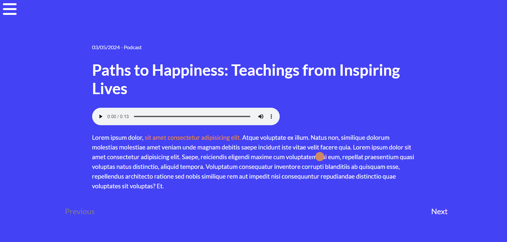

# Description
In the following project, I used HTML, CSS and JavaScript to create a fictional podcast website. I chose a harmonious color palette 
and implemented a custom cursor with JavaScript. The site was developed with a focus on mobile devices, ensuring an optimized experience 
for these users.

# Main Features
- HTML and CSS
- JavaScript
- Personalized cursor
- Motion design

# Screenshot

